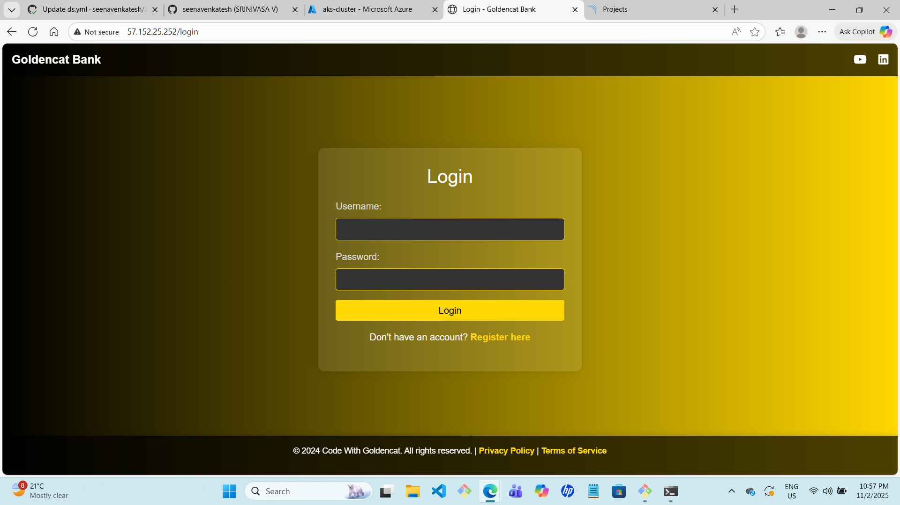
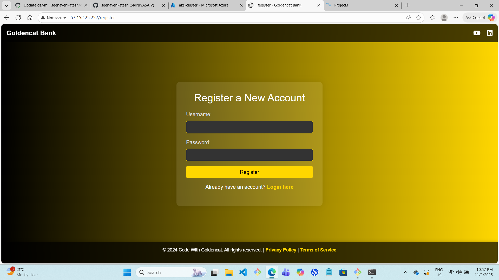
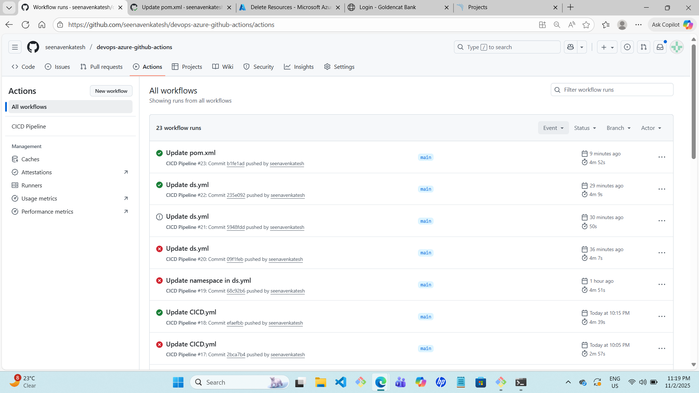
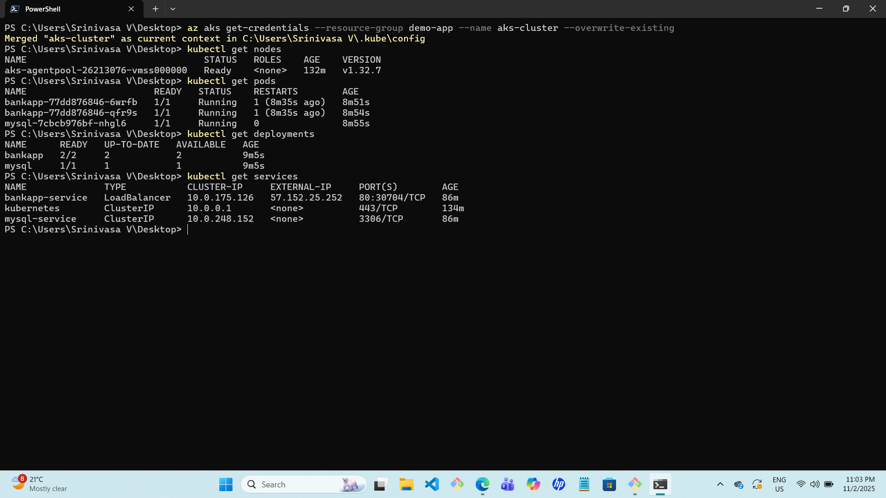
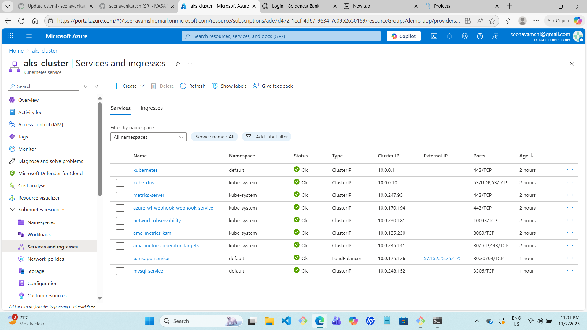
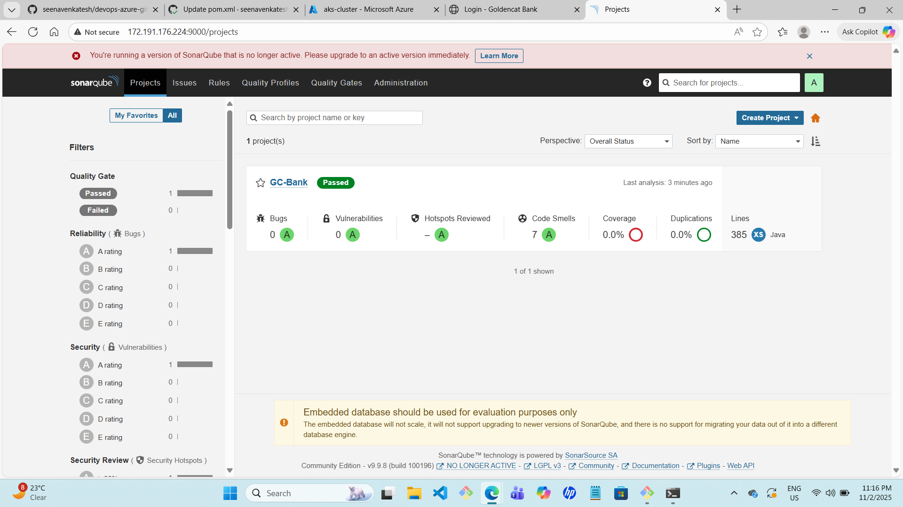

# devops-azure-github-actions
End-to-end CI/CD pipeline using GitHub Actions, Docker, SonarQube, and Trivy to deploy a Java application on Azure Kubernetes Service (AKS) via Azure Container Registry (ACR).

🧠 Overview

bankapp is a Java Spring Boot application containerized using Docker and deployed on Azure Kubernetes Service (AKS) in the eastus region. This project implements a complete CI/CD pipeline using GitHub Actions with DevSecOps integrations such as SonarQube, Trivy, and GitLeaks. bankapp is a Java Spring Boot application containerized using Docker and deployed on Azure Kubernetes Service (AKS). This project implements a complete CI/CD pipeline using GitHub Actions with DevSecOps integrations such as SonarQube, Trivy, and GitLeaks.


## 📂 Project Structure

```
bankapp/
├── .github/workflows/        # GitHub Actions CI/CD pipelines
│   └── CICD.yml              # Pipeline for build, scan, push and deploy
├── .mvn/wrapper/             # Maven wrapper files
├── src/                      # Java source code
├── .gitignore                # Git ignore rules
├── Dockerfile                # Dockerfile to build application image
├── README.md                 # Project documentation
├── ds.yml                    # Kubernetes Deployment & Service YAML
├── mvnw                      # Maven wrapper executable (Linux/Mac)
├── mvnw.cmd                  # Maven wrapper executable (Windows)
├── pom.xml                   # Maven project configuration
└── sonar-project.properties  # SonarQube configuration
```


## 🧰 Tech Stack

| Category             | Tools Used                 |
| -------------------- | -------------------------- |
| Application          | Java, Spring Boot          |
| Build Tool           | Maven                      |
| Containerization     | Docker                     |
| CI/CD                | GitHub Actions             |
| Cloud                | Microsoft Azure (AKS, ACR) |
| Security & DevSecOps | SonarQube, Trivy, GitLeaks |
| Version Control      | Git & GitHub               |


Below is a **Simple Architecture** followed in this project:

```
Developer → GitHub → GitHub Actions CI/CD → Azure Container Registry (ACR) → Azure Kubernetes Service (AKS)
```

**Flow Explanation:**

1. Developer pushes code to GitHub
2. GitHub Actions pipeline builds & tests the application
3. Performs DevSecOps scans (SonarQube, Trivy, GitLeaks)
4. Builds Docker image and pushes to Azure Container Registry (ACR)
5. Deploys the latest image to AKS (eastus)


## 📸 Application Screenshots

### 🏠 Home Page


### 🔐 Register Page


### 🚀 CI/CD Pipeline Success



### ✅ Pods Running in AKS


### 🌐 Service & Ingress


### 📊 Project Dashboard Overview
Shows code quality summary, bugs, vulnerabilities, code smells, and coverage.

